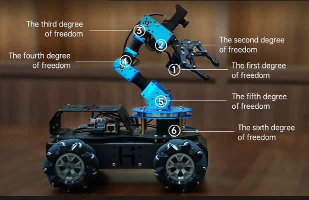
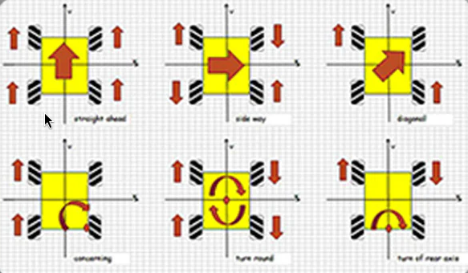
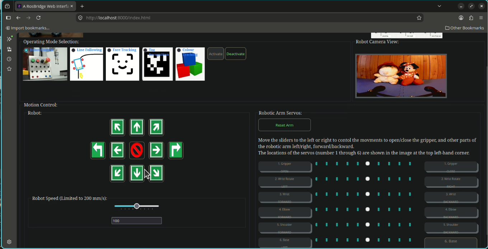

# A RosBridge Web Interface for the Hiwonder ArmPi Pro
I built a Rosbridge web interface to interact with the robot's ROS (Robot Operating System) applications(services) and to control the robot as a way to learn ROS. This is my journey. The following video shows my web interface and its capabilities.

Here is my Rosbridge Web Interface Demo video:

## 1. Introduction
The Hiwonder ArmPi Pro is a ROS 6-degree-of-freedom (6 DOF) robotic arm with a mecanum 4WD, a HD camera and a Raspberry Pi as its brain. It can slide left/right, move diagonally in addition to the movements possible with a normal 4WD robotic vehicle.

  Here are the 6 servos that control the robotic arm:
|Servo/DOF | Function | Movement |
| ------------ | ----------- | ----------- |
| 1 | Gripper | Open/Close |
| 2 | Wrist Rotation | Left/Right |
| 3 | Wrist | Up/Down |
| 4 | Elbow | Up/Down |
| 5 | Shoulder | Up/Down |
| 6 | Base | Left/Right |

Mecanum wheels are special omni-directional wheels with angled rollers that let a vehicle move in any direction, spin in place, and slide sideways without turning. 
  The possible mecanum 4WD movements are summarised below.

There are different hardware and software versions of ArmPi Pro eg, with Raspberry Pi 4/5, Ubuntu 18.04/RaspBerry Pi OS. Mine is the version with Raspberry Pi 4/Ubuntu 18.04 running ROS 1 and it cannot upgrade to Raspberry Pi OS/ROS2, at least for the time being. 
  I do not consider it a bad buy for learning ROS 1, OpenCV, mecanum wheels because the vendor provided Android/iOS demo apps, ROS applications (paxkages, services, topics, messages), a robot arm Action Group Editing software, videos, tutorials and most of the source code. The only thing missing is a web interface. And this gap is what I am planning to fill.

## 2. Accessing the ROS 1 Applications using a Rosbridge Web Interface

### 2.1 Exploring ROS Applications
Here are some interesting ROS application Youtube videos provided by the robot's vendor. They include:

1. [Line following](https://youtu.be/fGBhImZG8LA) - uses image processing techniues such as Binarysation, dilation and erosion to obtain the colour and line outline to follow. 
2. [Face Recognition](https://youtu.be/bo_oN9vdynM) - moves the robotic arm's mounted camera to look for a human face.
3. [Apriltag recognition](https://youtu.be/NLuyXT3cOCI) - [Apriltag](https://april.eecs.umich.edu/software/apriltag) is similar to QR code and bar code but contains less information and easier to detect. Once an apriltag isrecognised, the robot executes a specific movement associated with the tag.
4. [Colour tracking](https://youtu.be/e3AakZLZN14) - uses image processing techniues such as Binarysation, dilation and erosion to obtain the target colour and move the arm to track the colour's motion.

Both robot and robotic arm movements are controlled using ROS topics. Examples on how they are used can be found in my Rosbridge user interface source code: index.html.

| Component | Topic Name | Message Type |
| ------------ | ----------- | ----------- |
| Robot Chassis | /chassis_control/set_velocity | /chassis_control/chassis_control/set_velocity |
| Robotic Arm Single Servo | /servo_controllers/port_id_1/id_pos_dur | /hiwonder_servo_msgs/RawIdPosDur |
| Robotic Arm Multiple Servos| /servo_controllers/port_id_1/multi_id_pos_dur | /hiwonder_servo_msgs/MultiRawIdPosDur |

You can either ssh or remote desktop into the Raspberry Pi. The remote desktop server pre-installed in the OS image is called  [NoMachine](https://www.nomachine.com/). Yours may differ if you using a different version of the OS image. Once connected, open a terminal and issue the command:
<pre>
rosmsg show /hiwonder_servo_msgs/RawIdPosDur
</pre>
to display the fields inside the specified message type: "/hiwonder_servo_msgs/RawIdPosDur"

The applications are implemented using ROS services. They can be activated using the terminal as shown in the Youtube videos associated with each application. For example, to start the Apriltag Recognition service, issue the following commands:
<pre>
# start service
rosservice call /apriltag_detect/enter "{}"

# show image from camera
rqt_image_view

# start detecting apriltags
rosservice call /apriltag_detect/set_running "data: true"

# to terminate the service
rosservice call /apriltag_detect/set_running "data: false"
rosservice call /apriltag_detect/exit "{}"
</pre>
Here are some more useful ROS CLI commands:
<pre>
# show info about the service /apriltag_detect/set_running
ubuntu@ubuntu:~$ rosservice info /apriltag_detect/set_running
Node: /apriltag_detect
URI: rosrpc://ubuntu:40977
Type: std_srvs/SetBool
Args: data

# use the msg type displayed above, show its format
ubuntu@ubuntu:~$ rossrv show std_srvs/SetBool
bool data
---
bool success
string message

# show a topics's message type, publishers and subscribers
ubuntu@ubuntu:~$ rostopic info /servo_controllers/port_id_1/multi_id_pos_dur
Type: hiwonder_servo_msgs/MultiRawIdPosDur

Publishers: 
 * /face_detect (http://ubuntu:43081/)
 * /visual_patrol (http://ubuntu:41771/)
 * /color_tracking (http://ubuntu:45471/)
 * /apriltag_detect (http://ubuntu:41247/)
 * /rosbridge_websocket (http://ubuntu:36911/)

Subscribers: 
 * /hiwonder_servo_manager (http://ubuntu:33121/)

</pre>

### 2.2 A Rosbridge Web Interface
There is an Android/iOS demo application that can access the ROS 1 services but there is no web interface to access them. To build a web interface, we need a Rosbridge.

### 2.3 Rosbridge
Rosbridge provides a JSON API to ROS functionality for non-ROS programs using websockets. 
  The rosbridge server is a webSocket server that translates incoming JSON strings into native ROS commands. It comes pre-installed in the OS image provided by the vendor.
   I use the roslibjs and EventEmitter2 JavaScript libraries, css/html and Javascript to build my web user interface. A tutorial on roslibjs including calling ROS services, publishing/subscribing to topics, can be found [here](https://wiki.ros.org/roslibjs/Tutorials/BasicRosFunctionality).

### 2.4 Using My Rosbridge Web Interface
The Armpi Pro supports 2 modes of network connection:
1. Access Point (AP) Mode: The Raspberry Pi creates a hotspot that your mobile/notebook can connect to. This mode does not connect to the internet.
2. Station (STA) mode: The Raspberry Pi connects directly to a your wifi network. This mode allows access to the internet.

 My rosbridge web interface uses the STA mode.

#### 2.4.1 Starting the Web Interface
To run my Rosbridge web interface, make sure the robot has been powered on. Open a terminal on your computer and issue the following commands <B><I>(pay special attention to the dynamic generation of the config.js file below)</I></B>:
<pre>
# clone my repository
git clone ...

# change to the directory containing the index.html
cd rosbridge-web-interface

# define env variable ARMPI_PRO_IP
# replace the IP address with that of your robot
export ARMPI_PRO_IP="192.168.1.146"

# Javascript web applications cannot read env variables directly.
# This command generates the config file dynamically using the env variable ARMPI_PRO_IP.
# It is needed only the very first time or
# when you want to change the ARMPI_PRO_IP you connect to.
# index.html can read the config.js content because 
# it is included as a script.
envsubst < config.template.js > config.js

# start the http server
python3 -m http.server
</pre>
Then open a browser and point it to http://localhost:8000
  The web interface immediately connects to the robot using a websocket. A pop-up appears when connection is made. You can dismiss it and start using the web interface.

#### 2.4.2 Selecting and Starting an Application
Select the Robot Control radio button and click on the Activate button. The Robot Camera View and Motion Control panels appear. The next section concisely describes the Motion Control panels functionality in detail.
  If the websocket connection fails, a pop-up appears to inform you that the connection has been broken. You can dismiss it and click on the web browser's refresh button to re-establish the connection.

#### 2.4.3 The Motion Control Panel
The Motion Control panel is the most busy-looking part of the web interfaces.

  The Robot panel on the left controls the robots's movement. Clicking on any of the arrow buttons moves the robot in the direction of the arrow. Since the robot is using mecanum wheels, it moves like no ordinary 4WD robots. The diagonal arrows moves the robot diagonally and the side arrows moves the robot sideway. The 2 turn arrows rotates the robot in the respective direction. The Robot Speed panel allows you to change the speed of the robot. It is in the range 0 to 200 mm/s.
  The Robotic Arm Servo panel controls how each part of the robotic arm moves. You move the slider to the left or right to initiate the movement to Open/Left/Forward or Close/Right/Backward respectively.

#### 2.4.4 Other Applications
You have to Deactivate the currently running application before selecting and activating another application. 
  When you select and activate the Line Following or colour tracking application, a Colour Target Selection panel appears for you to choose the target's colour.
  When you select the Face Tracking or the Tag Recognition application, you will see the following screen.
  You interact with the application you selected in the way shown in the Youtube videos whose links are in Section 2.1

## 3. Conclusions
I provded you with a Rosbridge Web Interface for the Hiwonder Armpi Pro robot. Using it, you can use a browser to interact with the robot. I hope you will find it useful.

  The OS image contains 92 ROS services, 66 ROS topics and some demo Python scripts. I am still  exploring them. It takes time.
<pre>
# show # of ROS services
ubuntu@ubuntu:~$ rosservice list | wc -l
92

# show # of ROS topics
ubuntu@ubuntu:~$ rostopic list | wc -l
66
</pre>

  One Python demo script I find particularly interesting, so far, is the Inverse Kinematics demo.Forward kinematics starts with known joint angles to find where the gripper lands, whereas Inverse kinematics starts with the target gripper position to find the unknown joint angles. My Robot Control application uses Forward Kinematics but Inverse Kinematics is also useful, if not more so. 
  The demo script constantly changes the posture of the robotic arm while the robot is moving resulting in the end of robotic arm staying motionless despite the robot's movement.
  Although the Inverse kinematics Python script is interesting, it was not implemented as a ROS service meaning that users cannot access it externally. My plan is to make it into a ROS service and access it using my updated Rosbridge Web Interface. Stay tuned. 

